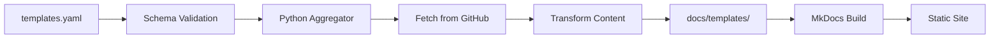

# Designing the Template Registry: ADR-003

How we built a declarative configuration system for Railway templates with JSON Schema validation.

<!-- more -->

## The Problem

We needed a way to register templates without touching code. Every new template shouldn't require modifying Python scripts or HTML—just add an entry to a configuration file and the site rebuilds.

The configuration needed to:

1. Define which templates appear on the site
2. Specify where to find documentation in each repo
3. Provide metadata for the template grid (features, cost, tags)
4. Catch errors before they reach production

## Why YAML?

We considered three formats:

| Format | Pros | Cons |
|--------|------|------|
| YAML | Human-readable, comments allowed, matches mkdocs.yml | Syntax can be tricky |
| TOML | Matches Railway's railway.toml | Less common in Python ecosystem |
| JSON | Strict, universal | No comments, verbose |

YAML won because:

1. **Consistency**: Our `mkdocs.yml` is already YAML
2. **Comments**: We can document inline why certain fields exist
3. **Readability**: Non-engineers can understand and edit it

## The Schema

Here's what a template entry looks like:

```yaml
templates:
  - id: litellm-langfuse-starter
    repo:
      owner: "amiable-dev"
      name: "litellm-langfuse-railway"
    title: "LiteLLM + Langfuse Starter"
    description: "Production-ready LLM gateway with observability"
    category: observability
    tags:
      - litellm
      - langfuse
    directories:
      docs:
        - path: "starter/README.md"
          target: "overview.md"
    links:
      railway_template: "https://railway.app/template/..."
      github: "https://github.com/amiable-dev/litellm-langfuse-railway"
    features:
      - "100+ LLM Providers"
      - "Cost Tracking"
    estimated_cost:
      min: 29
      max: 68
      currency: "USD"
      period: "month"
```

Required fields: `id`, `repo`, `title`, `description`, `category`, `directories.docs`

Everything else is optional.

## Validation with JSON Schema

YAML is flexible, which means it's easy to make mistakes. We use JSON Schema to catch errors early:

```yaml
# templates.schema.yaml
properties:
  templates:
    items:
      type: object
      additionalProperties: false  # Catch typos!
      required:
        - id
        - repo
        - title
        - description
        - category
        - directories
      properties:
        id:
          type: string
          pattern: "^[a-z][a-z0-9-]*$"
        # ...
```

The `additionalProperties: false` is important. Here's what happens with a typo:

```yaml
# Bad config - spot the typo
templates:
  - id: my-template
    repo:
      owner: "amiable-dev"
      name: "my-repo"
    title: "My Template"
    description: "A template"
    category: observability
    directories:
      docs:
        - path: "README.md"
          target: "overview.md"
    featurs:  # Typo!
      - "Feature 1"
```

With `additionalProperties: false`, the schema rejects this:

```
$.templates[0]: Additional properties are not allowed ('featurs' was unexpected)
```

Without it, the typo would silently pass—and the aggregation script would just skip the field.

## CI Integration

Validation runs on every PR:

```yaml
# .github/workflows/validate.yml
- name: Validate templates.yaml schema
  run: check-jsonschema --schemafile templates.schema.yaml templates.yaml

- name: Validate unique template IDs
  run: |
    python -c "
    import yaml
    with open('templates.yaml') as f:
        config = yaml.safe_load(f)
    ids = [t['id'] for t in config.get('templates', [])]
    duplicates = [id for id in ids if ids.count(id) > 1]
    if duplicates:
        exit(1)
    "
```

Error messages are actionable:

```
$.templates[0]: 'repo' is a required property
$.templates[0].id: 'INVALID_ID' does not match '^[a-z][a-z0-9-]*$'
```

## The Aggregation Flow



1. CI validates `templates.yaml` against the JSON Schema
2. Python aggregator reads the config (YAML → Python dict)
3. For each template, fetches docs from `directories.docs` paths
4. Transforms content (rewrites links, adds attribution)
5. Writes to `docs/templates/{id}/`
6. MkDocs builds the static site

The script uses `.get()` for optional fields, so missing `features` or `estimated_cost` don't break the build.

## What We Learned

1. **Strict schemas catch bugs early**: `additionalProperties: false` is your friend
2. **Validate on PRs, not just deploys**: Developers should see errors before merge
3. **JSON Schema can't do everything**: We added a Python check for unique IDs

## What's Next

- **ADR-006**: Cross-project documentation aggregation (the script that reads this config)

---

**Links:**

- [ADR-003: Template Configuration System](https://github.com/amiable-dev/amiable-templates/blob/main/docs/adrs/ADR-003-template-configuration-system.md)
- [templates.yaml](https://github.com/amiable-dev/amiable-templates/blob/main/templates.yaml)
- [templates.schema.yaml](https://github.com/amiable-dev/amiable-templates/blob/main/templates.schema.yaml)
