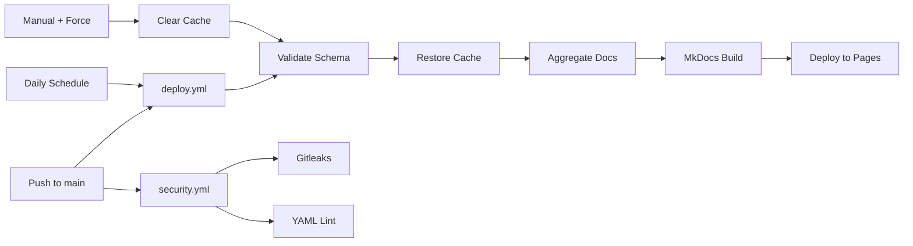

# CI/CD for a Docs Site: ADR-004

How we built a deployment pipeline that stays fresh without manual intervention.

<!-- more -->

## The Problem

We needed a CI/CD pipeline that could:

1. Deploy on merge to main
2. Aggregate docs from upstream repos daily
3. Allow manual rebuilds with cache bypass
4. Run security scanning without slowing deploys

## Why GitHub Pages?

We considered three options:

| Platform | Cost | PR Previews | HTTPS | Vendor Count |
|----------|------|-------------|-------|--------------|
| GitHub Pages | Free | No | Auto (*.github.io) | 1 |
| Netlify/Vercel | Free tier | Yes | Auto | 2 |
| Railway | ~$5/mo | Yes | Auto | 2 |

Cost wasn't the deciding factor—all have generous free tiers. What mattered:

1. **Vendor consolidation** - secrets, permissions, and logs in one place
2. **No external OAuth** - fewer security surface areas
3. **Workflow simplicity** - deploy-pages action just works

**The trade-off:** No PR preview deployments. We accepted this because our site is documentation—reviewing markdown diffs is sufficient. For a React app with visual changes, we'd choose differently.

**Note:** Custom domains need DNS configuration and propagation time. The `*.github.io` subdomain gets HTTPS immediately.

## The Pipeline



Key insight: `security.yml` runs in parallel with `deploy.yml`. A linting failure doesn't block deployment—but it does show up as a failed check on the commit.

Three triggers, one pipeline:

```yaml
on:
  push:
    branches: [main]
  schedule:
    - cron: '0 6 * * *'  # Daily at 6 AM UTC
  workflow_dispatch:
    inputs:
      force_refresh:
        type: boolean
        default: false
```

## Caching Strategy

Template aggregation fetches docs from GitHub repos. Without caching, every build would re-fetch everything.

Our approach:

1. **Cache key** includes `hashFiles('templates.yaml')` - config changes invalidate
2. **Restore keys** allow partial cache hits
3. **Manifest tracking** in aggregation script compares commit SHAs

```yaml
- name: Restore template cache
  if: ${{ github.event.inputs.force_refresh != 'true' }}
  uses: actions/cache@v5
  with:
    path: .cache/templates
    key: templates-${{ hashFiles('templates.yaml') }}-${{ github.run_id }}
    restore-keys: |
      templates-${{ hashFiles('templates.yaml') }}-
      templates-
```

The force refresh option clears the cache entirely:

```yaml
- name: Clear cache (if force refresh)
  if: ${{ github.event.inputs.force_refresh == 'true' }}
  run: rm -rf .cache/templates
```

## Security Scanning

Separate workflow, parallel execution:

```yaml
# security.yml
jobs:
  gitleaks:
    # Secret scanning on every push

  dependency-review:
    # License and vulnerability check on PRs

  yaml-lint:
    # Configuration validation
```

This keeps security checks from blocking deploys while still catching issues.

## The yamllint War Story

Our first security run failed spectacularly:

```
##[error]mkdocs.yml:88:5 [indentation] wrong indentation: expected 6 but found 4
##[error]templates.yaml:45:121 [line-length] line too long (156 > 120 characters)
##[warning].github/workflows/deploy.yml:3:1 [truthy] truthy value should be one of [false, true]
```

The investigation revealed three conflicts:

1. **`on:` is not a boolean** - GitHub Actions uses `on:` as a keyword, but yamllint sees it as a truthy value
2. **MkDocs doesn't require `---`** - yamllint's `document-start` rule expects it
3. **Description fields are long** - template descriptions exceed 120 characters

The fix: `.yamllint.yml` configuration that respects ecosystem conventions:

```yaml
rules:
  # GitHub Actions uses `on:` as a keyword
  truthy:
    allowed-values: ['true', 'false', 'on']

  # MkDocs files don't need document start
  document-start: disable

  # Allow longer lines for descriptions
  line-length:
    max: 200
```

Lesson: Linting tools need per-ecosystem configuration. Default rules assume vanilla YAML.

## Build Times

| Scenario | Time |
|----------|------|
| Cold build (no cache) | ~45s |
| Warm build (cached) | ~20s |
| Force refresh | ~45s |

Most deploys hit the cache. Daily scheduled builds may be slower if upstream repos changed.

## What We Learned

1. **Separate security from deploy** - don't let linting failures block urgent content fixes
2. **Cache aggressively, invalidate precisely** - manifest-based tracking beats time-based expiry
3. **Make force refresh easy** - when caching goes wrong, you need an escape hatch

## What's Next

- **ADR-005**: DevSecOps implementation (the security.yml details)

---

**Links:**

- [ADR-004: CI/CD and Deployment](https://github.com/amiable-dev/amiable-templates/blob/main/docs/adrs/ADR-004-ci-cd-deployment.md)
- [deploy.yml](https://github.com/amiable-dev/amiable-templates/blob/main/.github/workflows/deploy.yml)
- [security.yml](https://github.com/amiable-dev/amiable-templates/blob/main/.github/workflows/security.yml)
