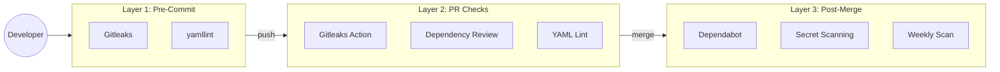

# DevSecOps for a Docs Site (ADR-005)

We added security scanning to a documentation site. Most DevSecOps guides assume you have application code. We don't.

<!-- more -->

## The Problem

Documentation repositories have different security concerns than application code:

- **No server-side runtime** - no SQL injection or RCE vectors (though DOM-based XSS remains possible)
- **No application secrets** - but build-time secrets (GitHub tokens, API keys) can still leak
- **Community contributions** - forks need to pass CI without repository secrets

Most DevSecOps tooling is overkill here. SAST (static code analysis) and DAST (runtime probing) assume you have application code. Container scanning assumes you have containers. We needed a minimal, fork-friendly approach.

## The 3-Layer Pipeline



**Layer 1** catches issues before they're committed. **Layer 2** validates PRs from forks (no secrets required). **Layer 3** runs post-merge for ongoing protection.

## Fork-Friendly Design

This was the key constraint. GitHub intentionally isolates repository secrets from fork PRs to prevent malicious PRs from exfiltrating credentials.

**The failure mode we avoided:** If your security workflow requires `SONAR_TOKEN` or similar, every community contribution triggers a CI failure. Contributors wait for maintainers to manually approve, friction accumulates, contributions slow down.

Our security workflow uses only:

```yaml
env:
  GITHUB_TOKEN: ${{ secrets.GITHUB_TOKEN }}
```

`GITHUB_TOKEN` is automatically provided to all workflows, including forks. No API keys, no OAuth tokens, no external services.

**What this enables:**

- Contributors don't need to configure anything
- All security checks pass on fork PRs
- No "skip CI" friction for external contributions
- Avoids the `pull_request_target` security footgun

## The Gitleaks Gotcha

Our first implementation had a dangerous allowlist:

```toml title=".gitleaks.toml (DANGEROUS)"
# DON'T DO THIS - excludes all markdown from scanning
[allowlist]
paths = [
  '''\.md$''',
]
```

This excludes all markdown files from secret scanning. For a documentation repository, that's most of the codebase.

**Why this matters:** Documentation often contains tutorial code blocks. Engineers copy-paste examples and accidentally include real API keys. Markdown files are where secrets leak in docs repos.

The fix: allowlist specific patterns, not entire file types:

```toml title=".gitleaks.toml (SAFE)"
# DO THIS - only ignore explicit example patterns
[[rules]]
id = "example-api-key"
regex = '''sk-example-[a-zA-Z0-9]+'''
allowlist = { regexes = ['''sk-example-'''] }

[[rules]]
id = "placeholder-key"
regex = '''YOUR_API_KEY|your-api-key'''
allowlist = { regexes = ['''YOUR_API_KEY|your-api-key'''] }
```

Real secrets in markdown files will still be caught. Only explicit example patterns (`sk-example-*`, `YOUR_API_KEY`) are ignored.

## Tools We Didn't Use

| Tool | Why Excluded |
|------|--------------|
| **CodeQL** | No codebase to analyze |
| **Snyk** | Dependabot sufficient at this scale |
| **Trivy** | No containers |
| **SonarCloud** | Overkill for docs |
| **Semgrep** | No application code |

The right amount of security tooling is the minimum that covers your actual risks.

## War Story: The YAML 1.1 Truthy (aka "The Norway Problem")

Our security workflow failed immediately:

```
[truthy] truthy value should be one of [false, true]
  3:1      error    on:
```

GitHub Actions uses `on:` as a keyword. But YAML 1.1 treats `on`, `off`, `yes`, and `no` as booleans. This is sometimes called "The Norway Problem" because country code `NO` gets parsed as `false`.

Fix in `.yamllint.yml`:

```yaml title=".yamllint.yml"
rules:
  truthy:
    allowed-values: ['true', 'false', 'on']
    check-keys: false
```

## The Minimal Stack

<div class="grid cards" markdown="1">

- **Pre-Commit**

    [Gitleaks](https://github.com/gitleaks/gitleaks) + [yamllint](https://github.com/adrienverge/yamllint)

- **PR Checks**

    [Gitleaks Action](https://github.com/gitleaks/gitleaks-action) + [Dependency Review](https://github.com/actions/dependency-review-action)

- **Post-Merge**

    [Dependabot](https://docs.github.com/en/code-security/dependabot) + [Secret Scanning](https://docs.github.com/en/code-security/secret-scanning)

</div>

Total configuration: 3 files, ~50 lines of YAML.

## Full ADR

See [ADR-005: DevSecOps Implementation](../adrs/ADR-005-devsecops-implementation.md) for the complete Architecture Decision Record.
