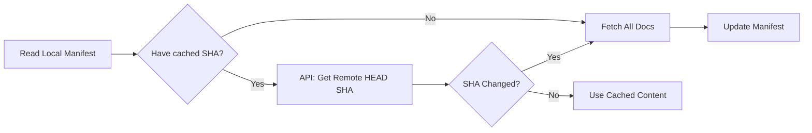

# Build-Time Documentation Aggregation (ADR-006)

We built a system to fetch documentation from multiple GitHub repositories at build time. The trick: SHA-based caching that makes incremental builds near-instant.

<!-- more -->

## The Problem

We have templates across multiple repositories:

- `litellm-langfuse-railway` (starter + production configs)
- `llm-council` (multi-model consensus system)

Each has its own documentation. Users shouldn't have to visit three different repos to understand their options.

**Goal**: Unified documentation portal with content from all template repos.

## Why Build-Time Aggregation?

We considered three approaches:

| Approach | Pros | Cons |
|----------|------|------|
| **Manual copy** | Simple | Stale immediately |
| **Git submodules** | Real-time | Complex, version conflicts |
| **Build-time fetch** | Fresh daily, cacheable | Requires API access |

Build-time aggregation wins: content is fresh (daily rebuilds), caching makes it fast, and errors don't break the site.

## The Caching Strategy

The naive approach: fetch everything on every build. With 3 templates and multiple docs each, that's slow and hits API rate limits.

Our approach: **SHA-based cache invalidation** with a lightweight API check.

### How It Works



**The key insight**: We don't download content to check if it changed. One lightweight API call (`GET /repos/{owner}/{repo}/commits/HEAD`) returns the current SHA. Compare against the manifest. Done.

```python
async def get_commit_sha(self, owner: str, repo: str) -> str | None:
    """Get the SHA of the default branch HEAD (1 API call, no content)."""
    url = f"{GITHUB_API_BASE}/repos/{owner}/{repo}/commits/HEAD"
    async with self._session.get(url) as resp:
        if resp.status == 200:
            data = await resp.json()
            return data["sha"]  # Just the SHA, not the content
```

### Cache Granularity: Repo-Level

We cache at the **repo level**, not file level. One new commit invalidates all docs from that repo. This is simpler than tracking individual file changes, and repos don't change that often.

The manifest tracks:

```json
{
  "litellm-langfuse-starter": {
    "commit_sha": "5a45454c15e0e5e17ff20a3f0d6df421c1f037db",
    "fetched_at": "2026-01-03T18:43:43Z",
    "files": ["overview.md", "setup.md"]
  }
}
```

**Result**: If the repo hasn't changed, skip the fetch entirely.

```
2026-01-03 18:44:00 [INFO]   Using cached content (SHA: 5a45454)
```

## Content Transformation

Raw content from upstream repos has relative links that break when moved. The `ContentTransformer` class handles this:

### Link Rewriting

```python
def _rewrite_links(self, content: str) -> str:
    """Rewrite relative markdown links to GitHub blob URLs."""
    # [Setup Guide](./setup.md)
    # → [Setup Guide](https://github.com/owner/repo/blob/sha/path/setup.md)
```

### Image Rewriting

```python
def _rewrite_images(self, content: str) -> str:
    """Rewrite relative image paths to raw.githubusercontent.com URLs."""
    # 
    # → 
```

### Source Attribution

Every aggregated doc gets an info box:

```markdown
!!! info "Source Repository"
    This documentation is from [amiable-dev/litellm-langfuse-railway](...).
    Last synced: 2026-01-03 | Commit: `5a45454`
```

Users always know where the content came from.

## Error Handling Philosophy

**Never fail the build due to upstream issues.** But be loud about failures.

### Hard vs. Soft Errors

| Error Type | Behavior |
|------------|----------|
| **Config errors** (invalid YAML) | Fail fast |
| **Network errors** | Use cached content, log warning |
| **Repo not found** | Skip, log warning |
| **File not found** | Skip file, continue |
| **Rate limit** | Use cached content |

```python
results = await asyncio.gather(
    *[aggregate_template(t, fetcher, cache, output_dir) for t in templates],
    return_exceptions=True,  # Collect errors, don't fail
)

for result in results:
    if isinstance(result, Exception):
        logger.error(f"Aggregation error: {result}")  # Be loud
```

### Stale Content Risk

The danger: a repo fails to update for weeks, and users see stale docs thinking they're current.

**Mitigation**: The source attribution box includes sync date and commit SHA. Users can verify freshness:

```markdown
!!! info "Source Repository"
    Last synced: 2026-01-03 | Commit: `5a45454`
```

If the sync date is old, something's wrong. CI logs show fetch failures for investigation.

## GitHub API Considerations

### Rate Limit Math

| Auth Method | Limit | Our Usage |
|-------------|-------|-----------|
| Unauthenticated | 60/hour | Not viable |
| `GITHUB_TOKEN` | 5,000/hour | What we use |
| GitHub App | 5,000+/hour | Overkill for docs |

**Our request pattern per build:**

- 3 repos × 1 SHA check = **3 API requests**
- Content fetched via `raw.githubusercontent.com` (no rate limit)
- Cached builds: **0 content fetches**

Even with 50 repos, we'd use 50 requests per build. The 5,000/hour limit is plenty.

### Fetch Optimization

```python
# SHA check: Uses API (rate limited, but just 1 request per repo)
url = f"{GITHUB_API_BASE}/repos/{owner}/{repo}/commits/HEAD"

# Content fetch: Uses raw.githubusercontent.com (no rate limit!)
url = f"{GITHUB_RAW_BASE}/{owner}/{repo}/{sha}/{path}"
```

This split is intentional: the API for metadata, raw URLs for content.

## CI Integration

```yaml title=".github/workflows/deploy.yml"
- name: Restore template cache
  uses: actions/cache@v5
  with:
    path: .cache/templates
    key: templates-${{ hashFiles('templates.yaml') }}-${{ github.run_id }}
    restore-keys: |
      templates-${{ hashFiles('templates.yaml') }}-
      templates-

- name: Aggregate template documentation
  env:
    GITHUB_TOKEN: ${{ secrets.GITHUB_TOKEN }}
  run: python scripts/aggregate_templates.py
```

The cache key strategy:
1. Exact match: same config, same run → use cache
2. Partial match: same config, different run → restore, then update
3. No match: fresh fetch

## The Tradeoff We Accepted

**Delayed updates**: Changes to upstream repos aren't instant. They appear on the next daily build (or manual dispatch).

For documentation, this is acceptable. If you need real-time sync, consider webhooks or git submodules—but accept the complexity.

## Full ADR

See [ADR-006: Cross-Project Documentation Aggregation](../adrs/ADR-006-cross-project-adr-aggregation.md) for the complete decision record.
